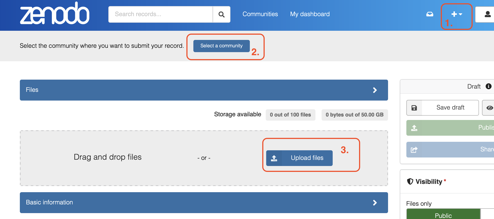
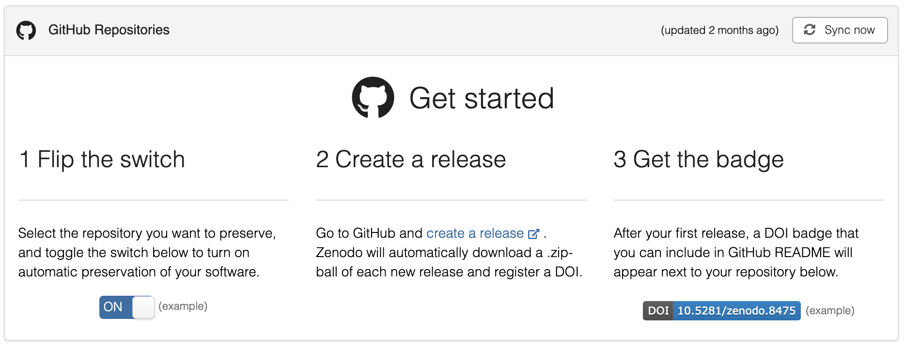

# Contributing to GMCI

The GMCI initiative is backed by topically related community submissions. We allow two types of submissions:

:::: {.callout-tip collapse="true" title="Dataset (Dataset Collection)" icon="false"}
Log into [Zenodo](https://zenodo.org/) via GitHub, ORCID, OpenAIRE, or create a new account.

To upload a dataset or dataset collection, \[Step 1\] click on the '+' to create a new record and \[Step 2\] select the [Graphical Modelling and Causal Inference](https://zenodo.org/communities/mardigmci) community. \[Step 3\] Upload the desired files and give as much additional information as possible in the cells below.



Please upload a dataset as a .csv file and a collection of datset as a .zip file. If applicable, auxiliary files (graph, ground truth, license, extended description) should be up uploaded as separate files. We require the 'description' of the Zenodo to have the following format:

::: {style="color: gray; margin-left: 1cm;"}
*A description of the dataset/dataset collection.*

*\# always two blank rows between information blocks*

**Task:** *A description of the Task.*

**Summary:**

-   **Size of dataset:** *Nr. of samples* x *Nr. of dimensions*

-   **Task:** Causal *Discovery Problem / Causal Inference Problem*

-   **Data Type:** *Continuous Data / Mixed Data / Discrete Data / Binary Data / Categorical Data*

-   **Dataset Scope:** *Collection of Datasets / Standalone Dataset*

-   **Ground Truth:** *Known Graph / Partial Graph / Unknown Graph*

-   **Temporal Structure:** Static Data / Time Series Data

-   **License:** CC0 / CC BY / CC BY-NC / ...

-   **Missing Values:** Existing Missing Values / No Missing Values

**Missingness Statement:** *Missingness Statement, if applicable.*

**Collection:** *\# If applicable.*

-   **Dataset1:** Description Dataset1

-   **Dataset2:** Description Dataset2

-   ...

**Features:**

-   ***Feature1:** Description Feature1*

-   ***Feature2:** Description Feature2*

-   ...

**Files:**

-   ***File1**: Description File1*

-   ***File2:** Description File2*

-   ...

**License:** *\# If applicable. Please indicate the main license (dataset, not of supporting material) above*

-   ***File1:** License1*

-   ***File2:** License2*
:::
::::

::: {.callout-note collapse="true" title="Analysis Notebook" icon="false"}
Log into [Zenodo](https://zenodo.org/) via GitHub, ORCID, OpenAIRE, or create a new account.

Create a git repository with (1) the code, and (2) the notebook's rendered .html file. Then, [connected the repository with Zenodo](https://zenodo.org/account/settings/github/) as shown in the picture below.



This will automatically create a record of the zipped repository along with a unique DOI. As the whole repository is zipped, we advise to restrict the repository's content to the necessary files. The associated DOI will forward you to the Zenodo record, which you can submit it to the [Graphical Modelling and Causal Inference](https://zenodo.org/communities/mardigmci/records?q=&l=list&p=1&s=10) community by editing the record's page. Although the record's description is taken from the git release, the records meta-information can be edited manually afterwards, e.g., referencing a publication, linking the associated Zenodo dataset or specifying an R package.

We showcase the rendered notebooks on this website's gallery of [Accompanying Statistical Notebooks](notebooks.qmd). For this, please specify the path toward the .html in the submission text.

Please contact us when publishing a new release of the git repository. This will automatically trigger a new Zenodo version of the record. This website, however, will not be rendered automatically but manually by the MaRDI TA3 team. Note that the record on Zenodo, as a copy of the git, is permanent and previous record versions, respectively git releases, can still be accessed.
:::

For both options, a [Zenodo](https://zenodo.org/) record has to be created according to the structure above and submitted to the [GMCI Zenodo community](https://zenodo.org/communities/mardigmci/records?q=&l=list&p=1&s=10). The [community moderators](/index.qmd) process each submission, create the necessary embedding links, potentially request revisions, and assist with any questions. While accepted datasets appear in the GMCI Zenodo community, notebook submissions' git repositories will be backed on Zenodo with the analysis rendered and featured on this website's [library](/chapters/notebooks.qmd).

Central instruments of [FAIR](https://fairsharing.org/) [@Wilkinson2016] research are providing open data access to researchers and transparently communicating design decisions via metadata in a findable and well-structured place. Therefore, please provide as much additional information as possible in the submission procedure.

The ownership after acceptance will stay with the authors. Git repositories hosting the notebook will become a submodule of the [GMCI git repository](https://github.com/MaRDI4NFDI/StMaRDI), and Zenodo records will become part of the GMCI community.

There are no associated costs.

## About Zenodo

The [Zenodo](https://zenodo.org/) platform hosted by CERN provides a long-term storage solution with unique digital object identifiers (DOIs), which can be referred to in publications. Uploading datasets and notebooks after publication is possible, and metadata (e.g., descriptions, licenses, references, etc.) can also be changed after the initial record creation. Note that the created record and data cannot be deleted except under special circumstances. If uncertainties arise, it is possible to test the mechanics of Zenodo without creating permanent digital objects in [Zenodo's Sandbox Instance](https://sandbox.zenodo.org/).

```{=html}
<!--
## Suitable Publications for Contribution

::: {.callout-tip collapse="true" title="Publications and Author Details" icon="false"}
Personal Connections:

**Groups:** [Copenhagen](https://publichealth.ku.dk/about-the-department/biostat/research/) biostatisticians, [Kilbertus](https://sites.google.com/view/nikikilbertus/home) group

+-------------------------------------------------------------------------------------+------------------------------------------------------------------------------------------------------------------------------------------------------------------------------------------------------------------------------------------------------------------------------------------+---------------------------------------------------------------------------------+
| Contact                                                                             | Paper                                                                                                                                                                                                                                                                                    | Status                                                                          |
+=====================================================================================+==========================================================================================================================================================================================================================================================================================+=================================================================================+
| [K. Goebler](KONSTANTIN.GOEBLER@TUM.DE)                                             | [CausalAssembly](https://proceedings.mlr.press/v236/gobler24a.html)                                                                                                                                                                                                                      | ```{=html}                                                                      |
|                                                                                     |                                                                                                                                                                                                                                                                                          | <span style="color: orange;">to contact</span>                                  |
|                                                                                     |                                                                                                                                                                                                                                                                                          | ```                                                                             |
+-------------------------------------------------------------------------------------+------------------------------------------------------------------------------------------------------------------------------------------------------------------------------------------------------------------------------------------------------------------------------------------+---------------------------------------------------------------------------------+
| ~~Shimeng Huang at CoCaLa.~~                                                        |                                                                                                                                                                                                                                                                                          | ```{=html}                                                                      |
|                                                                                     |                                                                                                                                                                                                                                                                                          | <span style="color: red;">not suitable</span>                                   |
|                                                                                     |                                                                                                                                                                                                                                                                                          | ```                                                                             |
+-------------------------------------------------------------------------------------+------------------------------------------------------------------------------------------------------------------------------------------------------------------------------------------------------------------------------------------------------------------------------------------+---------------------------------------------------------------------------------+
| ```{=html}                                                                          | Energy Economics (unlikely that data can be published)                                                                                                                                                                                                                                   | ```{=html}                                                                      |
| <s>N. Sturma und Shiva</s>                                                          |                                                                                                                                                                                                                                                                                          | <span style="color: red;">5% that data can be published; Nils asks Shiva</span> |
| ```                                                                                 |                                                                                                                                                                                                                                                                                          | ```                                                                             |
+-------------------------------------------------------------------------------------+------------------------------------------------------------------------------------------------------------------------------------------------------------------------------------------------------------------------------------------------------------------------------------------+---------------------------------------------------------------------------------+
| [Wiebke Günther (+Urmi Ninad)](https://causalinferencelab.com/about/) (Runge group) | [Causal Flood](https://www.cambridge.org/core/services/aop-cambridge-core/content/view/94CAF271BD58539D3FC38679282334B6/S2634460223000171a.pdf/div-class-title-clustering-of-causal-graphs-to-explore-drivers-of-river-discharge-div.pdf); data from [GRDC](https://www.%20bafg.de/GRDC) | ```{=html}                                                                      |
|                                                                                     |                                                                                                                                                                                                                                                                                          | <span style="color: orange;">to contact</span>                                  |
|                                                                                     |                                                                                                                                                                                                                                                                                          | ```                                                                             |
+-------------------------------------------------------------------------------------+------------------------------------------------------------------------------------------------------------------------------------------------------------------------------------------------------------------------------------------------------------------------------------------+---------------------------------------------------------------------------------+
| [Rebecca Herman](https://causalinferencelab.com/about/) (Runge group)               | [Sahel precipation](https://link.springer.com/article/10.1007/s00382-023-06755-1); data from [CIMP5 / CIMP6](https://wcrp-cmip.org/)                                                                                                                                                     | ```{=html}                                                                      |
|                                                                                     |                                                                                                                                                                                                                                                                                          | <span style="color: orange;">to contact</span>                                  |
|                                                                                     |                                                                                                                                                                                                                                                                                          | ```                                                                             |
+-------------------------------------------------------------------------------------+------------------------------------------------------------------------------------------------------------------------------------------------------------------------------------------------------------------------------------------------------------------------------------------+---------------------------------------------------------------------------------+
| [Samuel Wang](https://ysamuelwang.com/)                                             | [High-dimensional Graphical Learning](https://arxiv.org/pdf/2105.02487); data from NYU                                                                                                                                                                                                   | ```{=html}                                                                      |
|                                                                                     |                                                                                                                                                                                                                                                                                          | <span style="color: orange;">to contact</span>                                  |
|                                                                                     |                                                                                                                                                                                                                                                                                          | ```                                                                             |
+-------------------------------------------------------------------------------------+------------------------------------------------------------------------------------------------------------------------------------------------------------------------------------------------------------------------------------------------------------------------------------------+---------------------------------------------------------------------------------+
| [Kirtan Padh](KIRTAN.PADH@TUM.DE) (Kilbertus group)                                 | [Stochastic Causal Programming](https://proceedings.mlr.press/v213/padh23a/padh23a.pdf) (semi-synthetic data)                                                                                                                                                                            | ```{=html}                                                                      |
|                                                                                     |                                                                                                                                                                                                                                                                                          | <span style="color: orange;">to contact</span>                                  |
|                                                                                     |                                                                                                                                                                                                                                                                                          | ```                                                                             |
+-------------------------------------------------------------------------------------+------------------------------------------------------------------------------------------------------------------------------------------------------------------------------------------------------------------------------------------------------------------------------------------+---------------------------------------------------------------------------------+

**Arxiv**

+-----------------------------------------------------+-------------------------------------------------------------------------------------------------------------------------------------------------+----------------------------------------------------------------------------------------------+
| Contact                                             | Paper                                                                                                                                           | Status                                                                                       |
+=====================================================+=================================================================================================================================================+==============================================================================================+
| Gongxu Luo; [Thomas Norman](thomas.norman@ucsf.edu) | [Gene Regulatory Network](https://arxiv.org/pdf/2501.10124); data download [here](https://www.ncbi.nlm.nih.gov/geo/query/acc.cgi?acc=GSE133344) | ```{=html}                                                                                   |
|                                                     |                                                                                                                                                 | <span style="color: orange;">to contact: T. Norman for License, G. Luo for submission</span> |
|                                                     |                                                                                                                                                 | ```                                                                                          |
+-----------------------------------------------------+-------------------------------------------------------------------------------------------------------------------------------------------------+----------------------------------------------------------------------------------------------+
:::
-->
```
