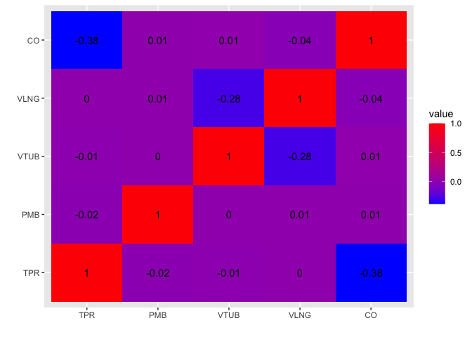
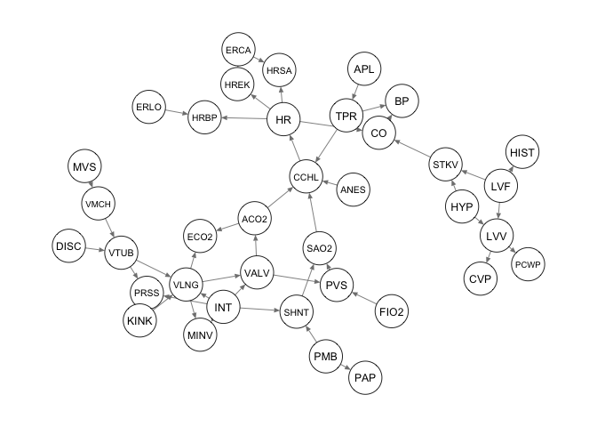
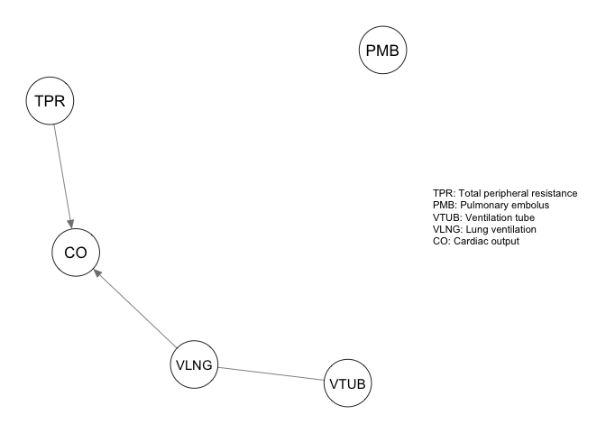
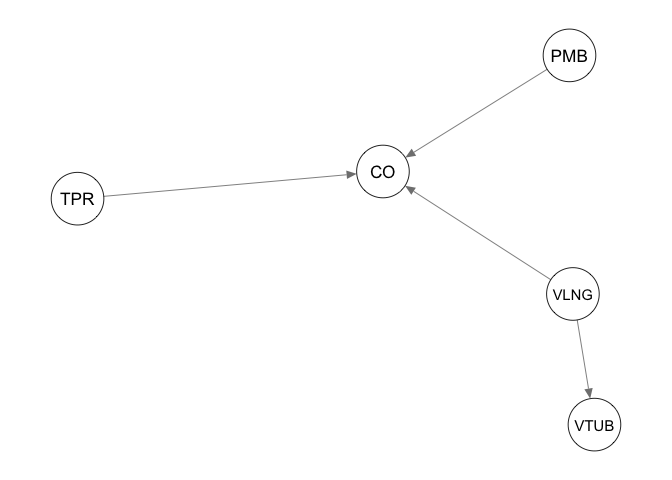
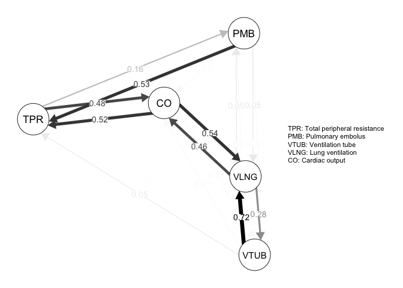

\*\* Setup of the problem \*\*

In the context of graphical modeling and structure learning from data we
consider a simple task of determining the most appropriate graphical
structure for a Bayesian network model (DAG estimation) based on the
available data. This problem is fundamental in probabilistic graphical
modeling, and it involves identifying the conditional dependencies
between variables in the dataset, which are represented by edges (arcs)
in the Bayesian network.

In this notebook we perform a simple experiment to estimate the
structure between the covariates from the (subset) of dataset “alarm”.

Loading the required libraries.

    library(bnlearn)
    library(qgraph)
    library("huge")
    library(ggplot2)
    library(tidyverse)

    ## ── Attaching core tidyverse packages ──────────────────────── tidyverse 2.0.0 ──
    ## ✔ dplyr     1.1.4     ✔ readr     2.1.5
    ## ✔ forcats   1.0.0     ✔ stringr   1.5.1
    ## ✔ lubridate 1.9.3     ✔ tibble    3.2.1
    ## ✔ purrr     1.0.2     ✔ tidyr     1.3.1
    ## ── Conflicts ────────────────────────────────────────── tidyverse_conflicts() ──
    ## ✖ dplyr::filter() masks stats::filter()
    ## ✖ dplyr::lag()    masks stats::lag()
    ## ℹ Use the conflicted package (<http://conflicted.r-lib.org/>) to force all conflicts to become errors

Loading the data from Zenodo collection/community:

    # necessary libraries to use for Zenodo REST-API
    library(zen4R)

    zenodo <- ZenodoManager$new(
      logger = "INFO" # use "DEBUG" to see detailed API operation logs, use NULL if you don't want logs at all
    )

    # downloading files using zenodo doi and reading from the file 
    rec1 <- zenodo$getRecordByDOI("10.5281/zenodo.7676616")

    ## [zen4R][INFO] ZenodoRequest - Fetching https://zenodo.org/api/records?q=doi:%2210.5281/zenodo.7676616%22&size=10&page=1&allversions=1

    ## ℹ Successfully fetched list of published records - page 1

    ## [zen4R][INFO] ZenodoManager - Successfully fetched list of published records - page 1

    ## ✔ Successfully fetched list of published records!

    ## [zen4R][INFO] ZenodoManager - Successfully fetched list of published records!

    ## ✔ Successfully fetched record for DOI '10.5281/zenodo.7676616'!

    ## [zen4R][INFO] ZenodoManager - Successfully fetched record for DOI '10.5281/zenodo.7676616'!

    files <- rec1$listFiles(pretty = TRUE)

    #create a folder where to download files from record
    dir.create("download_zenodo")

    #download files
    rec1$downloadFiles(path = "download_zenodo")

    ## ℹ Download in sequential mode

    ## [zen4R][INFO] ZenodoRecord - Download in sequential mode

    ## ℹ Will download 1 file from record '7676616' (doi: '10.5281/zenodo.7676616') - total size: 2 MiB

    ## [zen4R][INFO] ZenodoRecord - Will download 1 file from record '7676616' (doi: '10.5281/zenodo.7676616') - total size: 2 MiB

    ## ℹ Downloading file 'bnlearn_data.zip' - size: 2 MiB

    ## [zen4R][INFO] Downloading file 'bnlearn_data.zip' - size: 2 MiB

    ## ℹ File downloaded at '/Users/admin/Work/MaRDITA3/ntb_zenodo/StMaRDI/download_zenodo'.

    ## [zen4R][INFO] File downloaded at '/Users/admin/Work/MaRDITA3/ntb_zenodo/StMaRDI/download_zenodo'.

    ## ℹ Verifying file integrity...

    ## [zen4R][INFO] ZenodoRecord - Verifying file integrity...

    ## ℹ File 'bnlearn_data.zip': integrity verified (md5sum: f123ea701227cfd8a43996183b7c5279)

    ## [zen4R][INFO] File 'bnlearn_data.zip': integrity verified (md5sum: f123ea701227cfd8a43996183b7c5279)

    ## ✔ End of download

    ## [zen4R][INFO] ZenodoRecord - End of download

    downloaded_files <- list.files("download_zenodo")

    zipF = sprintf("download_zenodo/%s",downloaded_files)

    # unzipping in the current folder
    unzip(zipF,exdir = "./")

    alarm_name = list.files(tools::file_path_sans_ext(downloaded_files))[1]

    path_to_file = paste0(tools::file_path_sans_ext(downloaded_files),"/",alarm_name,"/",alarm_name,".csv")

    df = read.csv(path_to_file)
    head(df)

    ##      CVP   PCWP  HIST    TPR     BP     CO HRBP HREK HRSA    PAP   SAO2   FIO2
    ## 1 NORMAL NORMAL FALSE    LOW NORMAL   HIGH HIGH HIGH HIGH NORMAL NORMAL    LOW
    ## 2 NORMAL NORMAL FALSE NORMAL    LOW    LOW HIGH HIGH HIGH NORMAL    LOW NORMAL
    ## 3 NORMAL   HIGH FALSE NORMAL NORMAL   HIGH HIGH HIGH HIGH NORMAL    LOW NORMAL
    ## 4 NORMAL NORMAL FALSE    LOW    LOW   HIGH HIGH HIGH HIGH NORMAL NORMAL NORMAL
    ## 5 NORMAL NORMAL FALSE    LOW    LOW NORMAL HIGH HIGH HIGH NORMAL    LOW NORMAL
    ## 6 NORMAL NORMAL FALSE    LOW NORMAL   HIGH HIGH HIGH HIGH NORMAL    LOW NORMAL
    ##     PRSS ECO2 MINV    MVS   HYP   LVF   APL  ANES   PMB    INT  KINK  DISC
    ## 1   HIGH ZERO HIGH NORMAL FALSE FALSE FALSE FALSE FALSE NORMAL FALSE  TRUE
    ## 2   HIGH ZERO ZERO NORMAL FALSE FALSE FALSE FALSE FALSE NORMAL FALSE FALSE
    ## 3 NORMAL ZERO ZERO NORMAL FALSE FALSE FALSE FALSE FALSE NORMAL FALSE FALSE
    ## 4   HIGH ZERO ZERO NORMAL FALSE FALSE FALSE FALSE FALSE NORMAL FALSE FALSE
    ## 5    LOW ZERO ZERO NORMAL FALSE FALSE FALSE FALSE FALSE NORMAL FALSE FALSE
    ## 6   HIGH HIGH ZERO NORMAL FALSE FALSE FALSE  TRUE FALSE NORMAL FALSE FALSE
    ##      LVV   STKV CCHL  ERLO   HR  ERCA   SHNT    PVS   ACO2 VALV VLNG VTUB
    ## 1 NORMAL NORMAL HIGH FALSE HIGH FALSE NORMAL NORMAL NORMAL HIGH  LOW ZERO
    ## 2 NORMAL    LOW HIGH FALSE HIGH FALSE NORMAL    LOW    LOW ZERO ZERO  LOW
    ## 3 NORMAL NORMAL HIGH FALSE HIGH FALSE NORMAL    LOW    LOW ZERO ZERO  LOW
    ## 4 NORMAL NORMAL HIGH FALSE HIGH FALSE NORMAL NORMAL    LOW ZERO ZERO  LOW
    ## 5 NORMAL NORMAL HIGH FALSE HIGH FALSE NORMAL    LOW    LOW ZERO ZERO  LOW
    ## 6 NORMAL NORMAL HIGH FALSE HIGH FALSE NORMAL    LOW    LOW ZERO ZERO  LOW
    ##     VMCH
    ## 1 NORMAL
    ## 2 NORMAL
    ## 3 NORMAL
    ## 4 NORMAL
    ## 5 NORMAL
    ## 6 NORMAL

We need to transform data first

    for (item in colnames(df)){
      df[,item] = as.factor(df[,item])
    }

**Description of the data**.

The ALARM (“A Logical Alarm Reduction Mechanism”) is a Bayesian network
designed to provide an alarm message system for patient monitoring.

**The alarm data set contains the following 37 variables **:

    CVP (central venous pressure): a three-level factor with levels LOW, NORMAL and HIGH.

    PCWP (pulmonary capillary wedge pressure): a three-level factor with levels LOW, NORMAL and HIGH.

    HIST (history): a two-level factor with levels TRUE and FALSE.

    TPR (total peripheral resistance): a three-level factor with levels LOW, NORMAL and HIGH.

    BP (blood pressure): a three-level factor with levels LOW, NORMAL and HIGH.

    CO (cardiac output): a three-level factor with levels LOW, NORMAL and HIGH.

    HRBP (heart rate / blood pressure): a three-level factor with levels LOW, NORMAL and HIGH.

    HREK (heart rate measured by an EKG monitor): a three-level factor with levels LOW, NORMAL and HIGH.

    HRSA (heart rate / oxygen saturation): a three-level factor with levels LOW, NORMAL and HIGH.

    PAP (pulmonary artery pressure): a three-level factor with levels LOW, NORMAL and HIGH.

    SAO2 (arterial oxygen saturation): a three-level factor with levels LOW, NORMAL and HIGH.

    FIO2 (fraction of inspired oxygen): a two-level factor with levels LOW and NORMAL.

    PRSS (breathing pressure): a four-level factor with levels ZERO, LOW, NORMAL and HIGH.

    ECO2 (expelled CO2): a four-level factor with levels ZERO, LOW, NORMAL and HIGH.

    MINV (minimum volume): a four-level factor with levels ZERO, LOW, NORMAL and HIGH.

    MVS (minimum volume set): a three-level factor with levels LOW, NORMAL and HIGH.

    HYP (hypovolemia): a two-level factor with levels TRUE and FALSE.

    LVF (left ventricular failure): a two-level factor with levels TRUE and FALSE.

    APL (anaphylaxis): a two-level factor with levels TRUE and FALSE.

    ANES (insufficient anesthesia/analgesia): a two-level factor with levels TRUE and FALSE.

    PMB (pulmonary embolus): a two-level factor with levels TRUE and FALSE.

    INT (intubation): a three-level factor with levels NORMAL, ESOPHAGEAL and ONESIDED.

    KINK (kinked tube): a two-level factor with levels TRUE and FALSE.

    DISC (disconnection): a two-level factor with levels TRUE and FALSE.

    LVV (left ventricular end-diastolic volume): a three-level factor with levels LOW, NORMAL and HIGH.

    STKV (stroke volume): a three-level factor with levels LOW, NORMAL and HIGH.

    CCHL (catecholamine): a two-level factor with levels NORMAL and HIGH.

    ERLO (error low output): a two-level factor with levels TRUE and FALSE.

    HR (heart rate): a three-level factor with levels LOW, NORMAL and HIGH.

    ERCA (electrocauter): a two-level factor with levels TRUE and FALSE.

    SHNT (shunt): a two-level factor with levels NORMAL and HIGH.

    PVS (pulmonary venous oxygen saturation): a three-level factor with levels LOW, NORMAL and HIGH.

    ACO2 (arterial CO2): a three-level factor with levels LOW, NORMAL and HIGH.

    VALV (pulmonary alveoli ventilation): a four-level factor with levels ZERO, LOW, NORMAL and HIGH.

    VLNG (lung ventilation): a four-level factor with levels ZERO, LOW, NORMAL and HIGH.

    VTUB (ventilation tube): a four-level factor with levels ZERO, LOW, NORMAL and HIGH.

    VMCH (ventilation machine): a four-level factor with levels ZERO, LOW, NORMAL and HIGH.

Transforming the data to decode the categorical values as integers.

    alarm_df <- as.data.frame(na.omit(df))

    p = length(names(df))
    n = dim(df)[1]
     for (i in c(1:p)) {
         alarm_df[,i]<-as.numeric(alarm_df[,i])
    }

Applying nonparanormal transformation to standardize the data. More
precisely it transforms the data using the truncated empirical
probability distribution function and the final re-normalization.

    selection <- c("TPR","PMB","VTUB","VLNG","CO")

    #alarm_df <- huge.npn(alarm_df)
    alarm_df_npn = huge.npn(alarm_df)

    ## Conducting the nonparanormal (npn) transformation via shrunkun ECDF....done.

    head(alarm_df_npn)

    ##         CVP       PCWP        HIST        TPR        BP         CO       HRBP
    ## 1 0.5073642  0.6137092 -0.09973971 -0.1768279 1.7013279 -0.8713625 -0.6646985
    ## 2 0.5073642  0.6137092 -0.09973971  1.2401612 0.2199787  0.5248706 -0.6646985
    ## 3 0.5073642 -1.8179024 -0.09973971  1.2401612 1.7013279 -0.8713625 -0.6646985
    ## 4 0.5073642  0.6137092 -0.09973971 -0.1768279 0.2199787 -0.8713625 -0.6646985
    ## 5 0.5073642  0.6137092 -0.09973971 -0.1768279 0.2199787  1.6119505 -0.6646985
    ## 6 0.5073642  0.6137092 -0.09973971 -0.1768279 1.7013279 -0.8713625 -0.6646985
    ##         HREK       HRSA       PAP      SAO2        FIO2       PRSS      ECO2
    ## 1 -0.7062245 -0.7035549 0.1981972 3.1144053 -2.84981107 -0.9524646  0.673732
    ## 2 -0.7062245 -0.7035549 0.1981972 0.2543214  0.09241588 -0.9524646  0.673732
    ## 3 -0.7062245 -0.7035549 0.1981972 0.2543214  0.09241588  1.6472706  0.673732
    ## 4 -0.7062245 -0.7035549 0.1981972 3.1144053  0.09241588 -0.9524646  0.673732
    ## 5 -0.7062245 -0.7035549 0.1981972 0.2543214  0.09241588  0.5257479  0.673732
    ## 6 -0.7062245 -0.7035549 0.1981972 0.2543214  0.09241588 -0.9524646 -3.066870
    ##         MINV      MVS        HYP         LVF         APL       ANES        PMB
    ## 1 -1.9144844 0.190179 -0.3735556 -0.09049377 -0.01845303 -0.1917453 -0.0187271
    ## 2  0.5310157 0.190179 -0.3735556 -0.09049377 -0.01845303 -0.1917453 -0.0187271
    ## 3  0.5310157 0.190179 -0.3735556 -0.09049377 -0.01845303 -0.1917453 -0.0187271
    ## 4  0.5310157 0.190179 -0.3735556 -0.09049377 -0.01845303 -0.1917453 -0.0187271
    ## 5  0.5310157 0.190179 -0.3735556 -0.09049377 -0.01845303 -0.1917453 -0.0187271
    ## 6  0.5310157 0.190179 -0.3735556 -0.09049377 -0.01845303  2.3652828 -0.0187271
    ##           INT        KINK       DISC       LVV       STKV       CCHL       ERLO
    ## 1 -0.03581248 -0.06643384  2.4071300 0.5699623  0.4078339 -0.4523933 -0.0915921
    ## 2 -0.03581248 -0.06643384 -0.1806935 0.5699623 -1.6350478 -0.4523933 -0.0915921
    ## 3 -0.03581248 -0.06643384 -0.1806935 0.5699623  0.4078339 -0.4523933 -0.0915921
    ## 4 -0.03581248 -0.06643384 -0.1806935 0.5699623  0.4078339 -0.4523933 -0.0915921
    ## 5 -0.03581248 -0.06643384 -0.1806935 0.5699623  0.4078339 -0.4523933 -0.0915921
    ## 6 -0.03581248 -0.06643384 -0.1806935 0.5699623  0.4078339 -0.4523933 -0.0915921
    ##           HR       ERCA     SHNT      PVS       ACO2      VALV       VLNG
    ## 1 -0.5839908 -0.1820744 0.188705 3.335150  2.2090134 -1.919255 -1.6005522
    ## 2 -0.5839908 -0.1820744 0.188705 0.284708 -0.2197939  0.573119  0.4766123
    ## 3 -0.5839908 -0.1820744 0.188705 0.284708 -0.2197939  0.573119  0.4766123
    ## 4 -0.5839908 -0.1820744 0.188705 3.335150 -0.2197939  0.573119  0.4766123
    ## 5 -0.5839908 -0.1820744 0.188705 0.284708 -0.2197939  0.573119  0.4766123
    ## 6 -0.5839908 -0.1820744 0.188705 0.284708 -0.2197939  0.573119  0.4766123
    ##        VTUB     VMCH
    ## 1  1.903289 0.124569
    ## 2 -0.274845 0.124569
    ## 3 -0.274845 0.124569
    ## 4 -0.274845 0.124569
    ## 5 -0.274845 0.124569
    ## 6 -0.274845 0.124569

Subselecting certain variables for analysis. Splitting the data set into
the train (structure estimation) and the dataset for inference (given
the structure of the estimated graph) on the particular covariate.
Correlation maps of the given sub-selection of variables is presented.

    ## Warning: The `x` argument of `as_tibble.matrix()` must have unique column names if
    ## `.name_repair` is omitted as of tibble 2.0.0.
    ## ℹ Using compatibility `.name_repair`.
    ## This warning is displayed once every 8 hours.
    ## Call `lifecycle::last_lifecycle_warnings()` to see where this warning was
    ## generated.

Defining the true network structure for the alarm dataset (see paper
“Learning Bayesian Networks with the bnlearn R Package” by M.Scutari)

    dag_alarm <- empty.graph(names(alarm))
    modelstring(dag_alarm) <- paste("[HIST|LVF][CVP|LVV][PCWP|LVV][HYP][LVV|HYP:LVF]","[LVF][STKV|HYP:LVF][ERLO][HRBP|ERLO:HR][HREK|ERCA:HR][ERCA][HRSA|ERCA:HR]","[ANES][APL][TPR|APL][ECO2|ACO2:VLNG][KINK][MINV|INT:VLNG][FIO2]","[PVS|FIO2:VALV][SAO2|PVS:SHNT][PAP|PMB][PMB][SHNT|INT:PMB][INT]","[PRSS|INT:KINK:VTUB][DISC][MVS][VMCH|MVS][VTUB|DISC:VMCH]","[VLNG|INT:KINK:VTUB][VALV|INT:VLNG][ACO2|VALV][CCHL|ACO2:ANES:SAO2:TPR]","[HR|CCHL][CO|HR:STKV][BP|CO:TPR]", sep = "")
    qgraph(dag_alarm)

Selection of the specific covariates to perform the structure estimation
and the inference in the model task.

    alarm_dfSubset <-as.data.frame(alarm_df[,selection])

    alarm_df_str_est = alarm_dfSubset[str_set,]
    alarm_df_fit = alarm_dfSubset[est_set,]
    head(alarm_df_str_est)

    ##   TPR PMB VTUB VLNG CO
    ## 1   2   1    4    2  1
    ## 2   3   1    2    4  2
    ## 3   3   1    2    4  1
    ## 4   2   1    2    4  1
    ## 5   2   1    2    4  3
    ## 6   2   1    2    4  1

Applying the algorithm pc.stable to the dataset alarm

    Res<-pc.stable(alarm_df_str_est)

    bnlearn:::print.bn(Res)

    ## 
    ##   Bayesian network learned via Constraint-based methods
    ## 
    ##   model:
    ##     [partially directed graph]
    ##   nodes:                                 5 
    ##   arcs:                                  3 
    ##     undirected arcs:                     1 
    ##     directed arcs:                       2 
    ##   average markov blanket size:           1.60 
    ##   average neighbourhood size:            1.20 
    ##   average branching factor:              0.40 
    ## 
    ##   learning algorithm:                    PC (Stable) 
    ##   conditional independence test:         Pearson's Correlation 
    ##   alpha threshold:                       0.05 
    ##   tests used in the learning procedure:  28

Applying a set of constraint-based algorithms to estimate the DAG
structure between the selected variables.

    Res_stable=pc.stable(alarm_df_str_est)

    Res_iamb=iamb(alarm_df_str_est)

    Res_gs=gs(alarm_df_str_est)

    Res_fiamb=fast.iamb(alarm_df_str_est)

    Res_mmpc=mmpc(alarm_df_str_est)

Visualizing the estimated graph with PC-stable algorithm with respect to
the chosen variables. As we see the pc.stable algorithm returns a CPDAG.
For the inference purposes we manually set the (undirected) edges to
specific values.

    Labels <- c(
      "Total peripheral resistance",
      "Pulmonary embolus",
      "Ventilation tube",
      "Lung ventilation",
      "Cardiac output"
    )

    qgraph(Res, nodeNames = Labels, legend.cex = 0.35)

    # black magic to make it a proper DAG

    Res <- set.arc(Res, from = "PMB",to="CO")
    Res <- set.arc(Res, from = "TPR",to="CO")
    Res = set.arc(Res,from = "VLNG",to="VTUB")

    Res

    ## 
    ##   Bayesian network learned via Constraint-based methods
    ## 
    ##   model:
    ##    [TPR][PMB][VLNG][VTUB|VLNG][CO|TPR:PMB:VLNG] 
    ##   nodes:                                 5 
    ##   arcs:                                  4 
    ##     undirected arcs:                     0 
    ##     directed arcs:                       4 
    ##   average markov blanket size:           2.80 
    ##   average neighbourhood size:            1.60 
    ##   average branching factor:              0.80 
    ## 
    ##   learning algorithm:                    PC (Stable) 
    ##   conditional independence test:         Pearson's Correlation 
    ##   alpha threshold:                       0.05 
    ##   tests used in the learning procedure:  28

    graph <- qgraph(Res)

Fitting the model to the dataset.

    fit <- bn.fit(Res, alarm_df_fit)
    fit$CO

    ## 
    ##   Parameters of node CO (Gaussian distribution)
    ## 
    ## Conditional density: CO | TPR + PMB + VLNG
    ## Coefficients:
    ## (Intercept)          TPR          PMB         VLNG  
    ##  2.61248092  -0.39384628   0.01495855  -0.02626200  
    ## Standard deviation of the residuals: 0.7893206

    fit$VTUB

    ## 
    ##   Parameters of node VTUB (Gaussian distribution)
    ## 
    ## Conditional density: VTUB | VLNG
    ## Coefficients:
    ## (Intercept)         VLNG  
    ##   3.2383682   -0.2568879  
    ## Standard deviation of the residuals: 0.8209566

    fit$TPR

    ## 
    ##   Parameters of node TPR (Gaussian distribution)
    ## 
    ## Conditional density: TPR
    ## Coefficients:
    ## (Intercept)  
    ##    2.094853  
    ## Standard deviation of the residuals: 0.8253788

Nonparametrical bootstraping of the results of the model.

    set.seed(1)

    boot <- boot.strength(as.data.frame(alarm_dfSubset), R = 100, algorithm = "pc.stable")

    boot

    ##    from   to strength direction
    ## 1   TPR  PMB     0.69 0.2318841
    ## 2   TPR VTUB     0.05 0.1000000
    ## 3   TPR VLNG     0.00 0.0000000
    ## 4   TPR   CO     1.00 0.4750000
    ## 5   PMB  TPR     0.69 0.7681159
    ## 6   PMB VTUB     0.03 0.5000000
    ## 7   PMB VLNG     0.10 0.5000000
    ## 8   PMB   CO     0.01 1.0000000
    ## 9  VTUB  TPR     0.05 0.9000000
    ## 10 VTUB  PMB     0.03 0.5000000
    ## 11 VTUB VLNG     1.00 0.7200000
    ## 12 VTUB   CO     0.03 0.5000000
    ## 13 VLNG  TPR     0.00 0.0000000
    ## 14 VLNG  PMB     0.10 0.5000000
    ## 15 VLNG VTUB     1.00 0.2800000
    ## 16 VLNG   CO     1.00 0.4600000
    ## 17   CO  TPR     1.00 0.5250000
    ## 18   CO  PMB     0.01 0.0000000
    ## 19   CO VTUB     0.03 0.5000000
    ## 20   CO VLNG     1.00 0.5400000

    qgraph(boot,nodeNames=Labels,legend.cex = 0.35,
           edge.labels=TRUE,layout=graph$layout,asize=5,
           edge.color="black")

***References ***

\[1\] Beinlich I, Suermondt HJ, Chavez RM, Cooper GF (1989). “The ALARM
Monitoring System: A Case Study with Two Probabilistic Inference
Techniques for Belief Networks”. Proceedings of the 2nd European
Conference on Artificial Intelligence in Medicine, 247–256.
<https://doi.org/10.1007/978-3-642-93437-7_28>

\[2\] Scutari, M. Learning Bayesian Networks with bnlearn R package.
<https://arxiv.org/pdf/0908.3817.pdf>
