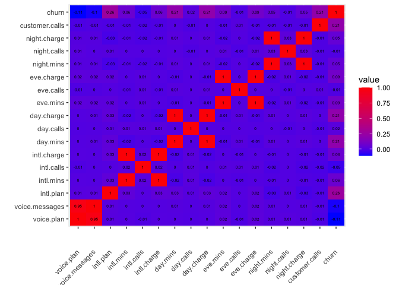
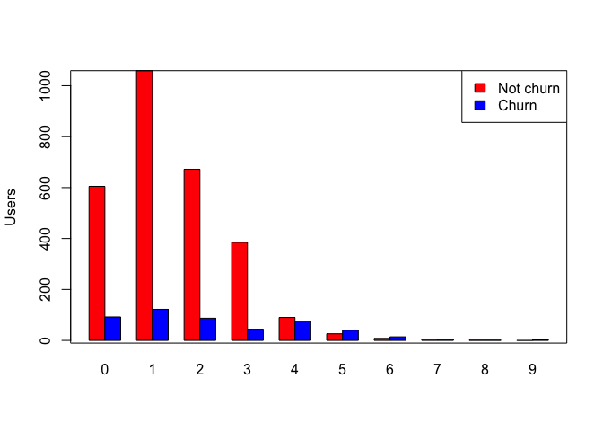
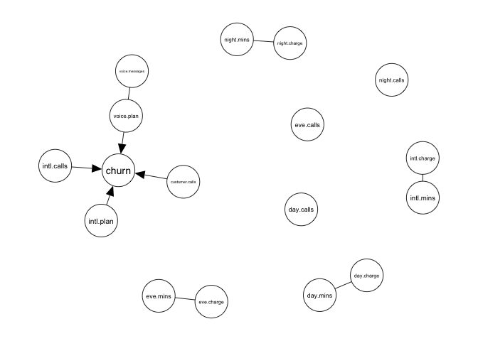
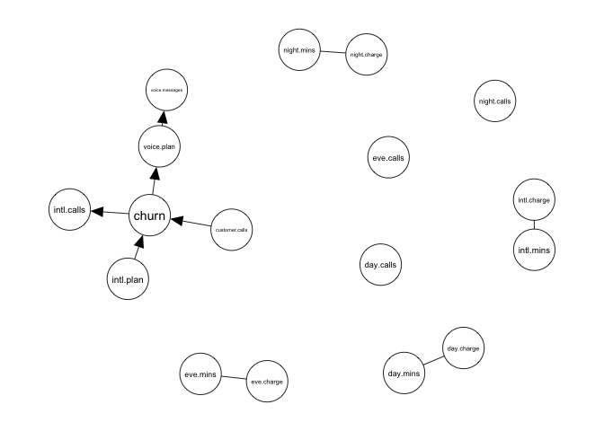

***Description of the dataset***

The churn dataset, as a data frame, contains 50000 rows (customers) and
20 columns (variables/features). The 20 variables are:

    state: Categorical, for the 5151 states and the District of Columbia.

    area.code: Categorical.

    account.length: count, how long account has been active.

    voice.plan: Categorical, yes or no, voice mail plan.

    voice.messages: Count, number of voice mail messages.

    intl.plan: Categorical, yes or no, international plan.

    intl.mins: Continuous, minutes customer used service to make international calls.

    intl.calls: Count, total number of international calls.

    intl.charge: Continuous, total international charge.

    day.mins: Continuous, minutes customer used service during the day.

    day.calls: Count, total number of calls during the day.

    day.charge: Continuous, total charge during the day.

    eve.mins: Continuous, minutes customer used service during the evening.

    eve.calls: Count, total number of calls during the evening.

    eve.charge: Continuous, total charge during the evening.

    night.mins: Continuous, minutes customer used service during the night.

    night.calls: Count, total number of calls during the night.

    night.charge: Continuous, total charge during the night.

    customer.calls: Count, number of calls to customer service.

    churn: Categorical, yes or no. Indicator of whether the customer has left the company (yes or no).

***Setup of the problem***

We explore the application of data-driven causal inference, which allows
to infer causal relationships purely from observational data. The aim is
to identify the reasons which may be the causes for a user of telecom
company to become churn and use them to predict the level of churn for a
customer while intervening on some of the parameters in the model.

``` r
### loading packages
library("liver")
library("qgraph")
library("igraph")
library("bnlearn")
library("dplyr")

df = read.csv("churn.csv")
```

__Loading the churn dataset__

``` r
#df = churn
#write.csv(churn,"churn.csv",sep = "\t",row.names = FALSE)
head(df)
```

    ##   state     area.code account.length voice.plan voice.messages intl.plan
    ## 1    KS area_code_415            128        yes             25        no
    ## 2    OH area_code_415            107        yes             26        no
    ## 3    NJ area_code_415            137         no              0        no
    ## 4    OH area_code_408             84         no              0       yes
    ## 5    OK area_code_415             75         no              0       yes
    ## 6    AL area_code_510            118         no              0       yes
    ##   intl.mins intl.calls intl.charge day.mins day.calls day.charge eve.mins
    ## 1      10.0          3        2.70    265.1       110      45.07    197.4
    ## 2      13.7          3        3.70    161.6       123      27.47    195.5
    ## 3      12.2          5        3.29    243.4       114      41.38    121.2
    ## 4       6.6          7        1.78    299.4        71      50.90     61.9
    ## 5      10.1          3        2.73    166.7       113      28.34    148.3
    ## 6       6.3          6        1.70    223.4        98      37.98    220.6
    ##   eve.calls eve.charge night.mins night.calls night.charge customer.calls churn
    ## 1        99      16.78      244.7          91        11.01              1    no
    ## 2       103      16.62      254.4         103        11.45              1    no
    ## 3       110      10.30      162.6         104         7.32              0    no
    ## 4        88       5.26      196.9          89         8.86              2    no
    ## 5       122      12.61      186.9         121         8.41              3    no
    ## 6       101      18.75      203.9         118         9.18              0    no

__Here we taking a glimpse in the data__

``` r
names(df)
```

    ##  [1] "state"          "area.code"      "account.length" "voice.plan"    
    ##  [5] "voice.messages" "intl.plan"      "intl.mins"      "intl.calls"    
    ##  [9] "intl.charge"    "day.mins"       "day.calls"      "day.charge"    
    ## [13] "eve.mins"       "eve.calls"      "eve.charge"     "night.mins"    
    ## [17] "night.calls"    "night.charge"   "customer.calls" "churn"

``` r
# transforming the "churns" to the numerical values
df$churn = ifelse(df$churn == "yes", 1, 0)

# transforming the intl.plan and voice.plan to the numerical values as well
# The goal of this part is to mutate the features voice.plan and intl.plan to the binary values

df$voice.plan = ifelse(df$voice.plan == "yes", 1, 0)
df$intl.plan =  ifelse(df$intl.plan == "yes", 1, 0)
```

__How many loyal and churn clients are there in the dataset__?

``` r
# Count the frequency of unique values of 
value_counts <- df %>%
  count(churn)

# Print the number of churn/loyal clients
print(value_counts)
```

    ##   churn    n
    ## 1     0 4293
    ## 2     1  707

``` r
# Cutting unnesessary text from a string and displaying the distribution of clients according to area
area_str = df$area.code
new_str = gsub('area_code_','',area_str)
df$area.code = as.numeric(new_str)
head(df)
```

    ##   state area.code account.length voice.plan voice.messages intl.plan intl.mins
    ## 1    KS       415            128          1             25         0      10.0
    ## 2    OH       415            107          1             26         0      13.7
    ## 3    NJ       415            137          0              0         0      12.2
    ## 4    OH       408             84          0              0         1       6.6
    ## 5    OK       415             75          0              0         1      10.1
    ## 6    AL       510            118          0              0         1       6.3
    ##   intl.calls intl.charge day.mins day.calls day.charge eve.mins eve.calls
    ## 1          3        2.70    265.1       110      45.07    197.4        99
    ## 2          3        3.70    161.6       123      27.47    195.5       103
    ## 3          5        3.29    243.4       114      41.38    121.2       110
    ## 4          7        1.78    299.4        71      50.90     61.9        88
    ## 5          3        2.73    166.7       113      28.34    148.3       122
    ## 6          6        1.70    223.4        98      37.98    220.6       101
    ##   eve.charge night.mins night.calls night.charge customer.calls churn
    ## 1      16.78      244.7          91        11.01              1     0
    ## 2      16.62      254.4         103        11.45              1     0
    ## 3      10.30      162.6         104         7.32              0     0
    ## 4       5.26      196.9          89         8.86              2     0
    ## 5      12.61      186.9         121         8.41              3     0
    ## 6      18.75      203.9         118         9.18              0     0

``` r
value_counts_area = df %>%
  count(area.code)
value_counts_area[2]=value_counts_area[2]/nrow(df)
print(value_counts_area)
```

    ##   area.code      n
    ## 1       408 0.2518
    ## 2       415 0.4990
    ## 3       510 0.2492

We are considering two sets of features: the ones with the numerical
attributes only (set “features”) and only with additional categorical
features “voice.plan”,“intl.plan” (set “features2”)

``` r
# choosing numerical features

features = c("voice.messages","intl.mins","intl.calls","intl.charge","day.mins", "day.calls", "day.charge","eve.mins","eve.calls", "eve.charge","night.mins","night.calls","night.charge","customer.calls","churn")

features2 = c("voice.plan","voice.messages","intl.plan","intl.mins","intl.calls","intl.charge","day.mins", "day.calls", "day.charge","eve.mins","eve.calls", "eve.charge","night.mins","night.calls","night.charge","customer.calls","churn")

for (i in features2){
  df[,i] = as.numeric(df[,i])
}
# What is the average number of minutes churn/loyal clients talk in a day ? 

mean(df[df$churn==1,features]$day.mins)
```

    ## [1] 207.8706

``` r
mean(df[df$churn==0,features]$day.mins)
```

    ## [1] 175.7466

``` r
What is the maximum length of the loyal clients who do not use the international plan?

max(df[(df$churn==0) &(df$intl.plan == 0),]$intl.mins)
```

    ## [1] 19.7

__Creating some pivot tables for specific values of customer calls__

``` r
cols = c("area.code","day.calls", "eve.calls", "night.calls")
cols_to_mean = c("day.calls", "eve.calls", "night.calls")
df_sb = df[,cols]

# Group by the 'Area code' column and calculate the mean for the selected columns
result = aggregate(. ~ area.code, data = df_sb, FUN = mean)[,cols_to_mean]
rownames(result) = aggregate(.~ area.code, data = df_sb, FUN = mean)[,"area.code"]
# Display the first 10 rows
head(result, 10)
```

    ##     day.calls eve.calls night.calls
    ## 408   99.5560  100.5107    99.32566
    ## 415  100.6269  100.2349    99.98036
    ## 510   99.3114   99.7801   100.39647

The overall scheme of this experiment consists in applying several
causal inference techniques, which give different types of results in
various forms, and extract a consensus, if any, in the light of the
different assumptions each model puts on the data.

Performing the estimation of correlations between features.

``` r
library(ggplot2)
library(tidyverse)
dat = as.matrix(cor(df[,features2]))
rownames(dat) = NULL
colnames(dat) = NULL


## convert to tibble, add row identifier, and shape "long"
dat2 <-
  dat %>%
  as_tibble() %>%
  rownames_to_column("Var1") %>%
  pivot_longer(-Var1, names_to = "Var2", values_to = "value") %>%
  mutate(
    Var1 = factor(Var1, levels = 1:17),
    Var2 = factor(gsub("V", "", Var2), levels = 1:17)
  )
#> Warning: The `x` argument of `as_tibble.matrix()` must have unique column names if
#> `.name_repair` is omitted as of tibble 2.0.0.
#> ℹ Using compatibility `.name_repair`.

ggplot(dat2, aes(Var1, Var2)) +
  geom_tile(aes(fill = value)) +
  geom_text(aes(label = round(value, 2)),size=1.75) +
  scale_fill_gradient(low = "blue", high = "red")+
  scale_x_discrete(name=c(""),breaks= 1:17,labels=features2) + 
  scale_y_discrete(name=c(""),breaks=1:17,labels =features2) +
  theme(axis.text.x = element_text(angle = 45, vjust = 0.5, hjust=1))
```



``` r
ggsave("churn_corr.png")
```

__Specifying the train and test subsets of the data__

``` r
n = nrow(df)
train_test_ratio = 2/3
index_set = c(1:n)

train_set = c(1:round(train_test_ratio*n))
test_set = setdiff(index_set, train_set)

df_train = df[train_set,]
df_test = df[test_set,]
```

First attempts to prognose the level of churn. Looking on the
international plan we try to observe what is the churn rate when a
client has/does not have international plan.

``` r
cross_tab = table(df_train$churn, df_train$intl.plan)
#addmargins(cross_tab)
rownames(cross_tab) = c("not churn","churn")
colnames(cross_tab) = c("no intl.plan", "intl.plan")
colours=c("red","blue")
barplot(cross_tab,ylab = "Users",beside = TRUE,col = colours)
box()
legend('topright',fill=colours,legend=c('Not churn','Churn'))
```


We observe that the users on international plan is more likely to become
churn, then the ones who does not have international plan.

Let us analyse the churn rate in relation to the number of customer
calls to the call-center.

``` r
cross_tab_calls = table(df_train$churn, df_train$customer.calls)
#addmargins(cross_tab)
rownames(cross_tab_calls) = c("not churn","churn")
#colnames(cross_tab_calls) = c("no intl.plan", "intl.plan")
colours=c("red","blue")
barplot(cross_tab_calls,ylab = "Users",beside = TRUE,col = colours)
box()
legend('topright',fill=colours,legend=c('Not churn','Churn'))
```


Observe that when the number of customer calls is larger then 3 the
churn rate increases.

``` r
###### Prepare the data to apply bnlearn functions/prodecures

Res<-pc.stable(df_train[,features2])

bnlearn:::print.bn(Res)
```

    ## 
    ##   Bayesian network learned via Constraint-based methods
    ## 
    ##   model:
    ##     [partially directed graph]
    ##   nodes:                                 17 
    ##   arcs:                                  9 
    ##     undirected arcs:                     5 
    ##     directed arcs:                       4 
    ##   average markov blanket size:           1.76 
    ##   average neighbourhood size:            1.06 
    ##   average branching factor:              0.24 
    ## 
    ##   learning algorithm:                    PC (Stable) 
    ##   conditional independence test:         Pearson's Correlation 
    ##   alpha threshold:                       0.05 
    ##   tests used in the learning procedure:  364

``` r
graph <- qgraph(Res, legend.cex = 0.35,
                asize=5,edge.color="black")
```



Model selection using the Markov blanket (Markov boundary) for the
target variable *y* = *c**h**u**r**n* and using some information
criteria. Using the logistic regression model to train to predict the
probability of client to be churn.

``` r
library("caret")
model_all = glm(churn ~., data = df_train[,features2], family = binomial(link = "logit"))

predictions = predict(model_all, newdata = df_test[,features2], type = "response")

acc = sum(round(predictions)==df_test$churn)/nrow(df_test)
sprintf("Accuracy of churn detection using all the variables %f", acc)
```

    ## [1] "Accuracy of churn detection using all the variables 0.870426"

``` r
confusionMatrix(factor(round(predictions)), factor(df_test$churn), positive = as.character(1))
```

    ## Confusion Matrix and Statistics
    ## 
    ##           Reference
    ## Prediction    0    1
    ##          0 1409  182
    ##          1   34   42
    ##                                           
    ##                Accuracy : 0.8704          
    ##                  95% CI : (0.8534, 0.8862)
    ##     No Information Rate : 0.8656          
    ##     P-Value [Acc > NIR] : 0.2972          
    ##                                           
    ##                   Kappa : 0.2274          
    ##                                           
    ##  Mcnemar's Test P-Value : <2e-16          
    ##                                           
    ##             Sensitivity : 0.18750         
    ##             Specificity : 0.97644         
    ##          Pos Pred Value : 0.55263         
    ##          Neg Pred Value : 0.88561         
    ##              Prevalence : 0.13437         
    ##          Detection Rate : 0.02519         
    ##    Detection Prevalence : 0.04559         
    ##       Balanced Accuracy : 0.58197         
    ##                                           
    ##        'Positive' Class : 1               
    ## 

``` r
f_imp = coef(model_all)
print(f_imp)
```

    ##    (Intercept)     voice.plan voice.messages      intl.plan      intl.mins 
    ##  -8.5681586249  -2.0261650055   0.0359681034   2.0456557319  -4.3477435131 
    ##     intl.calls    intl.charge       day.mins      day.calls     day.charge 
    ##  -0.0926430079  16.4267556472  -0.2254922664   0.0032319470   1.4026839656 
    ##       eve.mins      eve.calls     eve.charge     night.mins    night.calls 
    ##   0.7965398106   0.0010951844  -9.2858598435  -0.1243780097   0.0006676366 
    ##   night.charge customer.calls 
    ##   2.8457687821   0.5138614391

``` r
model_sbset = glm(churn ~ voice.plan+intl.plan+intl.calls+customer.calls,data = df_train[,features2], family = binomial(link = "logit") )

predictions_sbset = predict(model_sbset, newdata = df_test[,features2], type = "response")
acc_sbst = sum(round(predictions_sbset)==df_test$churn)/nrow(df_test)
sprintf("Accuracy of churn detection using subset the variables %f", acc_sbst)
```

    ## [1] "Accuracy of churn detection using subset the variables 0.869226"

``` r
#### Prediction using the model selection procedure  
```

Visualize resulting feature importance in the logistic regression

``` r
importance_data <- data.frame(Feature = names(f_imp), Importance = f_imp)

# Create a bar plot of feature importance
ggplot(importance_data, aes(x = Importance, y = Feature)) +
  geom_bar(stat = "identity", fill = "blue") +
  labs(title = "Feature Importance in Logistic Regression",
       x = "Importance",
       y = "Feature") +
  theme(axis.text.y = element_text(angle = 0, hjust = 1))  # Rotate x-axis labels for better readability
```


Different procedure to estimate the Markov blanket is given below. For
example we consider the algorithm IAMB \[2\] and the Grow-Shrink (GS)
\[3,4\] algorithm.

``` r
Res_iamb<-iamb(df_train[,features2])

bnlearn:::print.bn(Res_iamb)
```

    ## 
    ##   Bayesian network learned via Constraint-based methods
    ## 
    ##   model:
    ##     [partially directed graph]
    ##   nodes:                                 17 
    ##   arcs:                                  9 
    ##     undirected arcs:                     4 
    ##     directed arcs:                       5 
    ##   average markov blanket size:           1.18 
    ##   average neighbourhood size:            1.06 
    ##   average branching factor:              0.29 
    ## 
    ##   learning algorithm:                    IAMB 
    ##   conditional independence test:         Pearson's Correlation 
    ##   alpha threshold:                       0.05 
    ##   tests used in the learning procedure:  720

``` r
graph <- qgraph(Res_iamb, legend.cex = 0.35,
                asize=5,edge.color="black")


Res_gs<-gs(df_train[,features2])

bnlearn:::print.bn(Res_gs)
```

    ## 
    ##   Bayesian network learned via Constraint-based methods
    ## 
    ##   model:
    ##     [partially directed graph]
    ##   nodes:                                 17 
    ##   arcs:                                  9 
    ##     undirected arcs:                     4 
    ##     directed arcs:                       5 
    ##   average markov blanket size:           1.18 
    ##   average neighbourhood size:            1.06 
    ##   average branching factor:              0.29 
    ## 
    ##   learning algorithm:                    Grow-Shrink 
    ##   conditional independence test:         Pearson's Correlation 
    ##   alpha threshold:                       0.05 
    ##   tests used in the learning procedure:  537

``` r
graph <- qgraph(Res_gs, legend.cex = 0.35,
                asize=5,edge.color="black")
```



***Refererences***

\[1\] Margaritis D (2003). Learning Bayesian Network Model Structure
from Data. Ph.D. thesis, School of Computer Science, Carnegie-Mellon
University, Pittsburgh, PA. Available as Technical Report CMU-CS-03-153.

\[2\] Spirtes, P., and Glymour, C., 1991. An Algorithm for Fast Recovery
of Sparse Causal Graphs. Social Science Computer Review, vol. 9, Iss. 1,
62–72. <https://doi.org/10.1177/089443939100900106>

\[3\] P. Spirtes, C. Glymour, and R. Scheines. Causation, Prediction,
and Search. MIT press, 2nd edition,2000.
<https://doi.org/10.7551/mitpress/1754.001.0001>

\[4\] Tsamardinos, I., Aliferis, C.F. and Statnikov, A., 2003, August.
Time and sample efficient discovery of Markov blankets and direct causal
relations. In Proceedings of the ninth ACM SIGKDD international
conference on Knowledge discovery and data mining (pp. 673-678).
<https://doi.org/10.1145/956750.956838>

\[5\] Tsamardinos I, Aliferis CF, Statnikov A (2003). “Algorithms for
Large Scale Markov Blanket Discovery.” In “Proceedings of the Sixteenth
International Florida Artificial Intelligence Research Society
Conference,” pp. 376–381. AAAI Press. In
<https://doi.org/10.32473/flairs.v33i0.123621>
